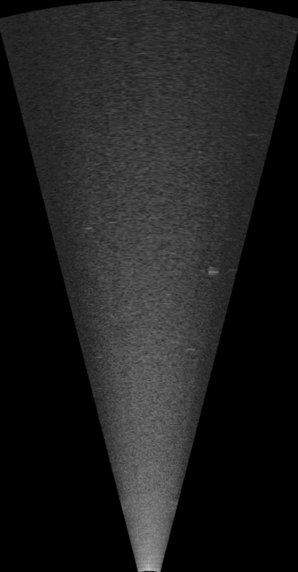

# sonaris
ARIS sonar acoustic file converter in Python

Description:
* parallel conversion with pathos (see the example 'test_sonaris.py')
* frame algorithm conversion from the Matlab toolbox ARISreader (https://github.com/nilsolav/ARISreader)
* only ARIS v5 files are supported
* Python module dependencies:
  * PIL
  * cv2

  

   <b>eel fish</b> 

